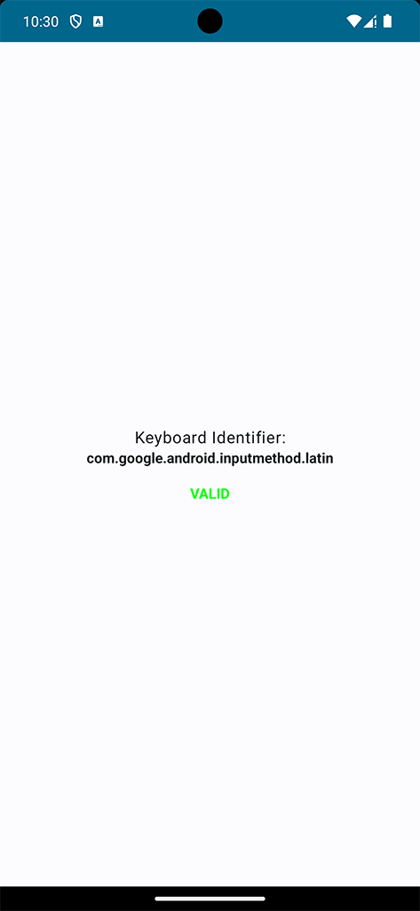

# Secure Keyboards - Android
In this Repository you will find a small Android app that shows how to retrieve the current keyboard identifier of an Android phone. This identifier can be used to allow/disallow specific keyboards. You may want to use this in a context, where privacy is of uttermost importance.

## Features
- **Get Keyboard Identifier**: Retrieve the current identifier
- **Validate Keyboard**: Check if the identifier is contained in a list of allowed keyboards

## Installation
Since there are no additional dependencies required, the installation is straightforward.
1. Clone the repository
2. Open it in Android Studio (or your desired IDE)
3. Run (or build) the app

## Example
Using a Pixel 7 Pro Simulator you should see the following screen when running the app:

## Acknowledgements
The code of this project is used in the "Privacy Keyboards" article on Medium [Privacy Secure Android Keyboards](https://medium.com/@mobile_44538/privacy-secure-android-keyboards-b11b322ffa41). Please check out the article for more information on the topic of privacy in the context of Android keyboards.
A Flutter version can also be found under [GitHub: secure-keyboards-flutter](https://github.com/EXXETA/secure-keyboards-flutter)

## License
This project is licensed under the MIT License - read the [LICENSE](LICENSE) file for more details.
